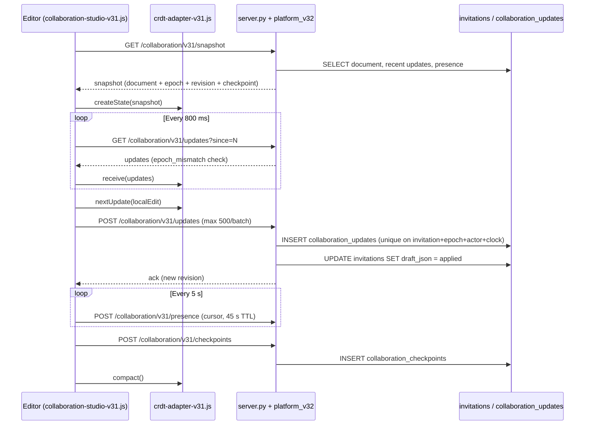

# eInvite Platform — Architecture

> **Phase 0.2 deliverable of `docs/ROADMAP.md`.** This rewrite replaces the pre-V29 era draft with an accurate picture of the current codebase (V53.1 + V54 hardening). Every claim below is grounded in a specific file path.

---

## 1. Component Diagram

```mermaid
flowchart TD
    subgraph Browser["Browser (build-tool-free)"]
        Editor["Editor Chrome<br/>unified-editor-v34, editor-pro"]
        Renderer["renderer-core.js<br/>shared safe object renderer"]
        CRDT["crdt-adapter-v31.js<br/>pure-JS CRDT engine"]
        CollabUI["collaboration-studio-v31.js<br/>short-poll + presence"]
        Public["public-page.js<br/>advanced-public-renderer-v32"]
        AIUI["ai-creative-agent-v28.js<br/>plan preview/confirm"]
        Assets["asset-workflow-v23.js<br/>upload-client.js"]
    end

    subgraph Server["Python stdlib server (server.py monolith)"]
        Router["ThreadingHTTPServer<br/>~150 routes"]
        Auth["security_v13.py<br/>Argon2id · MFA · Passkeys"]
        Audit["audit_events<br/>hash-chained, immutable"]
        RateLimit["rate_limit<br/>Redis or in-process"]
        Guard["guard_request_boundary<br/>host allowlist · HTTPS · framing"]
        Malware["security_scanner_v54.py<br/>ClamAV / Defender fail-closed"]
        Secrets["secrets_v54.py<br/>auto-gen .env"]
    end

    subgraph V32["platform_v32 (production hardening)"]
        V32Svc["service.py<br/>workspaces, roles, authz"]
        V32Store["storage.py<br/>ObjectStorage: local|s3|r2|minio"]
        V32Jobs["jobs.py<br/>durable JobQueue + idempotency"]
        V32Obs["observability.py<br/>secret-redacting logger"]
    end

    subgraph V52["future_platform_v52 (V34–V52 layer)"]
        V52Svc["service.py<br/>event ecosystem, automation"]
        V52Schema["schema.py<br/>schema 27 additive"]
    end

    subgraph AI["ai_agent (V28, V35, V53.1)"]
        AISvc["service.py"]
        Tools["tools.py · capabilities.py<br/>80 typed tools"]
        Providers["providers.py · local_providers.py<br/>6 provider classes"]
        Context["context.py · storage.py<br/>conversation persistence"]
    end

    subgraph Stores["External stores"]
        DB[("SQLite / PostgreSQL")]
        Cache[("Redis (optional)")]
        Object[("S3 / R2 / MinIO<br/>or local disk")]
        SMTP["SMTP (optional)"]
        External["External AI endpoint (optional)"]
    end

    Editor --> Renderer
    Editor --> CRDT
    Editor --> AIUI
    Editor --> Assets
    Editor --> CollabUI
    CollabUI --> CRDT
    Public --> Renderer
    AIUI --> Assets

    Editor -- "fetch credentials:'same-origin'" --> Router
    Public --> Router
    CollabUI -- "GET /collaboration/v31/updates?since=N<br/>(poll 800 ms)" --> Router
    AIUI --> Router

    Router --> Guard
    Router --> Auth
    Router --> Audit
    Router --> RateLimit
    Router --> Malware
    Router --> Secrets
    Router --> V32Svc
    Router --> V52Svc
    Router --> AISvc

    Auth --> DB
    Audit --> DB
    RateLimit --> Cache
    V32Svc --> DB
    V32Store --> Object
    V32Jobs --> DB
    V52Svc --> DB
    AISvc --> DB
    AISvc --> Providers
    Providers --> External
    Providers --> Cache
    V32Svc --> SMTP
```



---

## 2. Product Model

Every invitation is a versioned structured document. The same document drives the editor, template workflow, preview, immutable publication snapshot, and public guest experience.

```text
Template + event content + visual objects + page/section settings
                              |
                              v
                     Invitation document
                    /          |          \
              Editor      Preview       Publish snapshot
                                           |
                                           v
                                  Public invitation + RSVP
```

The document model is normalized through `src/python/document_schema_v32.py` (cumulative schema 18) and `future_platform_v52/schema.py` (schema 27 additive). Snapshot publishing (V32) makes the published state immutable; CRDT collaboration (V31) handles *live* editing without overwriting published state.

---

## 3. Subsystems

### 3.1 HTTP Server & Route Handler (stdlib `http.server` monolith)

- **Files**: `src/python/server.py` (~6,600 lines, 437 functions, ~150 routes); `Handler` class at line 2397; `connect()` at line 1370; `guard_request_boundary()` at line 2506; `end_headers()` at line 2410.
- **What it does**: A `ThreadingHTTPServer` monolith dispatching `do_GET` / `do_PUT` / `do_POST` / `do_DELETE` across:
  - `/api/auth/*` — register, login, logout, MFA, passkey flows
  - `/api/account/*` — user account, security settings, audit log
  - `/api/invitations/*` — invitation CRUD, including `collaboration/v31/{snapshot,updates,presence,checkpoints}`, `events` (SSE awareness), `raster/v30/documents`
  - `/api/admin/*` — admin overview
  - `/api/platform/v32/*` — V32 production platform (workspaces, object storage, jobs, observability)
  - `/api/platform/v52/*` — V52 event ecosystem
  - `/api/ai-agent/*` — AI agent (V28/V35/V53.1)
  - `/api/ai/assist` — assistant endpoint
  - `/api/billing/*` — billing webhooks
  - `/api/studio/*` — studio automation
  - `/api/templates*`, `/api/uploads/*`, `/api/public/*`
  - `/i/{slug}` — public invitation page
  - `/uploads/`, `/vendor/`, `/assets/` — static asset routes
  - Page HTML routes
- **Auth**: Cookie-first (HttpOnly `SameSite=Lax`, optional `Secure`); Bearer tokens only when `EINVITE_DEV_AUTH_TOKENS=1`.
- **Dependencies**: SQLite (default) or PostgreSQL (psycopg); optional Redis; optional SMTP; optional S3/R2/MinIO via boto3. Loads `ai_agent/`, `platform_v32/`, `future_platform_v52/` from repo root — **`PYTHONPATH=.` is required at startup.**

### 3.2 Authentication & Identity Layer

- **Files**: `src/python/security_v13.py`; `src/python/server.py` (register/login/logout/MFA/passkey routes at lines 3192–3211, 3952–4190; `user()` line 2676; `require_user()` line 2690; `guard_cookie_origin()` line 2601).
- **What it does**:
  - **Argon2id** passwords (time_cost=3, memory_cost=64 MB, parallelism=2, hash_len=32, salt_len=16, type=Type.ID). PBKDF2-HMAC-SHA256 (310 k iterations) fallback when `argon2-cffi` is unavailable. `verify_password` returns `(valid, should_rehash)` for in-place algo upgrade.
  - **MFA (TOTP, RFC 6238)** — `new_totp_secret`, `totp_code`, `verify_totp` (±1 window), `otpauth_uri`. Routes: `/api/account/mfa/*`, `/api/auth/mfa/complete`.
  - **Passkeys (WebAuthn)** — ES256-only attestation, sign-count replay protection. CBOR decoder, `parse_attestation_object`, `cose_ec2_to_pem`, `verify_es256_signature`, `verify_client_data`, `parse_assertion_auth_data`. Routes: `/api/auth/passkeys/*`, `/api/account/passkeys/*`. Audit events: `passkey.added`, `passkey.removed`, `login.passkey_success`.
  - **Double-submit CSRF token** bound to session hash.
  - Optional email-verification gate.
- **Dependencies**: `argon2-cffi` (optional), `cryptography` (optional, passkey ES256 verify); SQLite/PostgreSQL `users`, `sessions`, `passkeys`, `auth_challenges` tables.

### 3.3 AI Agent Tool Registry & Capability Discovery

- **Files**: `ai_agent/tools.py`, `ai_agent/capabilities.py`, `ai_agent/__init__.py`, `ai_agent/storage.py`, `ai_agent/service.py`.
- **What it does**:
  - **80 typed `ToolDefinition` entries** across 30+ groups: `read`, `object`, `transform`, `style`, `image`, `gallery`, `photo`, `page`, `invitation`, `event`, `guest`, `rsvp`, `analytics`, `account`, `materials`, `design`, `asset`, `check`, `fix`, `preview`, `export`, `publish`, `message`, `editor`, `marketplace`, `enterprise`, `animation`, `publishing`, `merge`, `plugin`.
  - Permission tiers: `read` / `edit` / `manage` / `admin`. *(ROADMAP Phase 1a will replace these with resource-scoped grants like `event:{id}:publish`.)*
  - `TOOL_BINDINGS` dict declares every tool's bound API path or editor function for runtime HTTP verification.
  - `build_access_snapshot()` gates tools by account/invitation role, plan, storage, archived state, workspace AI policy, and feature-table existence (`event_tasks_v52`, `plugin_installations_v48`, `animation_projects_v44`, `custom_domains_v45`, `data_merge_jobs_v47`, `marketplace_templates_v36`).
- **Dependencies**: SQLite/PostgreSQL.

### 3.4 AI Provider Adapters (provider-neutral with offline fallback)

- **Files**: `ai_agent/providers.py`, `ai_agent/local_providers.py`, `ai_agent/config.py`, `ai_agent/design_blueprints.py`, `ai_agent/context.py`.
- **What it does**: Six provider classes:
  - `FakeProvider` — test stub
  - `OfflineTemplateProvider` — deterministic template-filling fallback
  - `ExternalProvider` — HTTP POST to `EINVITE_AI_ENDPOINT` with bounded response schema + `projectDataIsUntrusted` policy
  - `LocalGovernedProvider` — server-only local-model planner
  - `FallbackProvider` — primary → fallbacks chain
  - `RoutedProvider` — ordered failover up to 8 routes
- Local providers default to Ollama (`http://127.0.0.1:11434`), LM Studio (`:1234`), GPT4All (`:4891`); loopback-only or admin allowlist; HTTP-only, no redirects.
- Capability gates for tools / vision / structured-output.
- **Dependencies**: optional external AI endpoint; optional local AI runtime.

### 3.5 V32 Production Platform

- **Files**: `platform_v32/service.py`, `platform_v32/storage.py`, `platform_v32/jobs.py`, `platform_v32/schema.py`, `platform_v32/config.py`, `platform_v32/observability.py`.
- **What it does**:
  - Multi-tenant workspaces (personal + organization); roles `viewer < reviewer < content-editor < designer < manager < owner` (`ROLE_ORDER` + `ROLE_PERMISSIONS`).
  - `ObjectStorage` provider-neutral abstraction (local | s3 | r2 | minio) with SSE-S3, multipart uploads, presigned URLs.
  - `JobQueue` (1–32 workers, 10 k queue, exponential retry, cancellation, idempotency keys).
  - Collaboration server endpoints (`collaboration_snapshot` / `updates` / `checkpoints` / `presence`).
  - Raster edit documents (2 MB cap, pixel-limit enforced).
  - `Observability` per-workspace metrics + secret-redacting logger.
  - Publication readiness validator walks every asset reference.
- **Dependencies**: SQLite/PostgreSQL; optional S3/R2/MinIO via boto3; thread pool.

### 3.6 V52 Future Platform (V34–V52 capability layer)

- **Files**: `future_platform_v52/service.py`, `future_platform_v52/schema.py`, `future_platform_v52/__init__.py`.
- **What it does**: Builds on V32 to provide:
  - V34 unified editor profiles
  - V35 production AI agent (workspace routing policies, saved workflows, monthly budget ledger, model role assignment)
  - V36 template marketplace
  - V42 enterprise/government (protocols, approval steps, directory, classification levels)
  - V44 animation projects + export jobs
  - V45 custom domains + publication environments
  - V47 data merge sources/jobs/variants
  - V48 plugin manifests/installations/grants (13 extension points)
  - V52 event ecosystem (programs/tasks/vendors/incidents/automations/automation_runs)
- Registers 4 job handlers: `animation-export-v44`, `bulk-generation-v47`, `event-automation-v52`, `marketplace-package-v36`.
- Schema version 27 (additive migrations only).
- **Dependencies**: V32 `PlatformService` + `AgentService` + audit callback.

### 3.7 CRDT Collaboration Adapter (pure client-side)

- **Files**: `src/js/crdt-adapter-v31.js` (38-line dense IIFE).
- **What it does**: Pure-JS CRDT engine frozen as `window.EInviteCRDTV31`. Operations: `set`, `delete`, `sequence-insert`, `sequence-move`, `rich-text` (paragraphId/runId/start/end spliced), `checkpoint`. Each update carries `version/id/documentId/epoch/actor/clock/type/objectType/path/payload/timestamp/origin`. `compareClock` (numeric clock → actor string tiebreak) resolves register conflicts. State vector per actor.
- Limits: `MAX_UPDATE_BYTES=256000`, `MAX_PENDING=2000`, `MAX_APPLIED=20000`.
- Functions: `createState`, `nextUpdate`, `apply`, `receive`, `acknowledge`, `compact`, `diff`, `fingerprint` (FNV-1a), `serialize`. Epoch mismatch throws `code=EPOCH_MISMATCH`.
- **Dependencies**: `window.EInviteDocumentV32`; localStorage for actor ID.

### 3.8 Collaboration Studio UI (transport + presence)

- **Files**: `src/js/collaboration-studio-v31.js` (36-line dense IIFE), `src/css/collaboration-studio-v31.css`, `src/js/canva-scale-v31.js`.
- **What it does**:
  - Joins room via `GET /api/invitations/{id}/collaboration/v31/snapshot`.
  - **Short-polls** `.../updates?since=N` every 800 ms (3 s offline).
  - Submits local CRDT updates via `POST .../updates` (epoch_mismatch check, max 500/batch).
  - Posts presence + cursor every 5 s via `POST .../presence`.
  - Creates durable checkpoints via `POST .../checkpoints` (calls `EInviteCRDTV31.compact()`).
  - Listens to `einvite:editor-command` events → diffs against `lastDocument` → emits CRDT updates.
  - Offline queue persisted to `localStorage[einvite-crdt-queue-v31:{invitationId}:{actor}]`. Recovery export = JSON blob.
- **Dependencies**: `window.EInviteCRDTV31`, `window.EInviteEditorBridge`, `window.EInviteContext`, `fetch credentials:'same-origin'`.

### 3.9 Pre-CRDT SSE Awareness Channel

- **Files**: `src/python/server.py::invitation_events` (line 4481).
- **What it does**: Short-lived `text/event-stream` at `GET /api/invitations/{id}/events` (30 ticks × 2 s ≈ 60 s). Emits `event: invitation-update` with `{updatedAt, clientId, mutationId}` when `invitations.updated_at` changes; `": keep-alive\n\n"` every 5th tick. EventSource reconnects automatically.
- **Awareness only — NOT a CRDT transport.**

### 3.10 V54 Security Hardening (scanner + secrets + preflight)

- **Files**: `src/python/security_scanner_v54.py`, `src/python/secrets_v54.py`, `src/python/production_preflight.py`, `src/python/dependency_preflight.py`, `deploy/linux/install-einvite-laptop.sh`, `deploy/.env.example`, `deploy/.env.production.example`.
- **What it does**:
  - **On-startup fail-closed malware scanner gate**:
    - Linux: ClamAV INSTREAM over UDS (`/run/clamav/clamd.ctl` + 3 fallbacks) and TCP `127.0.0.1:3310`.
    - Windows: `MpCmdRun.exe -Scan -ScanType 3 -File <path> -DisableRemediation`.
    - 60 s timeout. `scan_file` / `scan_bytes` never raise. `startup_preflight` raises `RuntimeError` unless `EINVITE_ALLOW_NO_SCANNER=1`. `MalwareDetected` → HTTP 422.
  - **Auto-secret generation** (`ensure_secret()`): generates `EINVITE_SECRET_KEY` + `EINVITE_BILLING_WEBHOOK_SECRET` (`secrets.token_urlsafe(64)`) into repo-root `.env` (mode 0600) when missing/placeholder; never overwrites non-placeholder values; refuses length < 32.
  - **Production preflight** (`production_preflight.py`): enforces `EINVITE_COOKIE_SECURE`, `EINVITE_ALLOWED_HOSTS`, `EINVITE_REQUIRE_MALWARE_SCAN` in production mode.
- **Dependencies**: optional clamd / clamdscan (Linux); optional MpCmdRun.exe (Windows); repo-root `.env`.

### 3.11 Asset Pipeline & Build System (route-bundle manifests)

- **Files**: `src/python/build_route_bundles.py`, `src/python/build_editor_bundle.py`, `src/python/build_page_manifests.py`, `src/python/sync_frontend_assets.py`, `docs/route-bundle-sources-v15.json`, `docs/route-bundles-v15.json`.
- **What it does**: Concatenates source JS/CSS files declared in `docs/route-bundle-sources-v15.json` into `bundle-<page>-v15.js` / `.css` written to **both** `src/python/` (server-served) AND `src/js/` + `src/css/` (repo truth). `--check` mode verifies byte-identical hashes. `sync_frontend_assets.py` mirrors HTML, `vendor/`, `assets/`, `licenses/` into `src/python/`. `server.py::ensure_frontend_assets` runs all three builders with `--check` at startup (and rebuilds in dev mode).
- **Dependencies**: Python 3 stdlib only.

---

## 4. Storage Abstraction

### 4.1 Object Storage (`platform_v32/storage.py::ObjectStorage`)

| Provider | Env var | Production required? | Notes |
|---|---|---|---|
| **Local** (filesystem) | `EINVITE_OBJECT_STORAGE_PROVIDER=local` (default) | No (dev only) | Root `DATA/objects-v32`; HMAC-SHA256 signed URLs for `/api/platform/v32/objects/{key}` |
| **AWS S3** | `EINVITE_OBJECT_STORAGE_PROVIDER=s3` | Yes | boto3; SSE-S3 AES256 on every PUT; presigned GET/POST URLs; multipart uploads |
| **Cloudflare R2** | `EINVITE_OBJECT_STORAGE_PROVIDER=r2` | Yes | S3-compatible via `EINVITE_OBJECT_STORAGE_ENDPOINT` |
| **MinIO** | `EINVITE_OBJECT_STORAGE_PROVIDER=minio` | Yes | S3-compatible via `EINVITE_OBJECT_STORAGE_ENDPOINT` |

### 4.2 Relational Database (`server.py::connect` line 1370)

| Backend | Trigger | Notes |
|---|---|---|
| **SQLite** (default) | `DB = DATA/invites.db` | `sqlite3.connect(DB, timeout=10)` |
| **PostgreSQL** | `EINVITE_DATABASE_URL` starts with `postgres://` or `postgresql://` | psycopg + dict_row; `PostgresAdapter` wraps connection; `_ensure_postgres_schema` runs idempotent migrations; legacy guest `token_hash` migration |

### 4.3 Cache / Rate-limit / Presence (`server.py::redis_client` line 205)

| Component | Backend | Notes |
|---|---|---|
| Rate-limit counters | Redis (optional via `EINVITE_REDIS_URL`) — `INCR` + `EXPIRE` per window bucket | In-process fallback: `RATE_BUCKETS` dict + `RATE_LOCK` |
| Presence | Redis (optional) — hash keys | In-process fallback: `PRESENCE_STATE` dict + `PRESENCE_LOCK` (60 s TTL) |

### 4.4 Background Job Queue (`platform_v32/jobs.py::JobQueue`)

- In-process `queue.Queue` (maxsize 10 000) + 0–32 worker threads.
- DB-backed `platform_jobs` table for durability + idempotency keys + retry tracking + cancellation flag.

### 4.5 SMTP (optional)

- `server.py::send_platform_email` line 220.
- Transactional email via `EINVITE_SMTP_*` for verification, password reset, security notifications.

### 4.6 Browser Persistence

- **localStorage**: workspace state, CRDT actor IDs, offline CRDT queues, sidebar collapse, theme.
- **IndexedDB**: offline editor fallbacks.

---

## 5. Collaboration Model

The platform uses **POLLING + CRDT + DURABLE CHECKPOINTS + SNAPSHOT PUBLISHING** (not pure SSE, not operational transform).



### DB tables

- `collaboration_updates` — unique on `invitation_id + document_epoch + actor_id + logical_clock`.
- `collaboration_checkpoints` — durable checkpoints for compaction + recovery.

### Roles

`viewer < reviewer < content-editor < designer < manager < owner` (defined in `platform_v32/service.py::ROLE_ORDER` + `ROLE_PERMISSIONS`).

---

## 6. Security Stack

| Control | File | Detail |
|---|---|---|
| **Argon2id** | `src/python/security_v13.py` (lines 20–37) | `PasswordHasher` time_cost=3, memory_cost=64 MB, parallelism=2, hash_len=32, salt_len=16, type=Type.ID. PBKDF2-HMAC-SHA256 310 k-iteration fallback. `verify_password` returns `(valid, should_rehash)`. |
| **MFA (TOTP, RFC 6238)** | `src/python/security_v13.py` + `src/python/server.py` | `new_totp_secret`, `totp_code`, `verify_totp` (±1 window), `otpauth_uri`. Routes `/api/account/mfa/*`, `/api/auth/mfa/complete`. |
| **Passkeys (WebAuthn)** | `src/python/security_v13.py` + `src/python/server.py` | ES256-only attestation; sign-count replay protection; CBOR decoder; `parse_attestation_object`, `cose_ec2_to_pem`, `verify_es256_signature`, `verify_client_data`, `parse_assertion_auth_data`. Routes `/api/auth/passkeys/*`, `/api/account/passkeys/*`. Audit events `passkey.added` / `passkey.removed` / `login.passkey_success`. |
| **CSP** | `src/python/server.py::end_headers` (line 2455) | `default-src 'self'; script-src 'self'; style-src 'self' 'unsafe-inline'; img-src 'self' data: blob: https:; media-src 'self' blob:; font-src 'self' data:; frame-src 'self' https://www.youtube.com https://www.youtube-nocookie.com https://w.soundcloud.com; connect-src 'self'; object-src 'none'; base-uri 'self'; frame-ancestors 'self'; form-action 'self'` |
| **Same-origin** | `src/python/server.py::guard_cookie_origin` (line 2601) + `guard_request_boundary` (line 2506) | Origin + Sec-Fetch-Site + double-submit CSRF token bound to session hash + host allowlist + Transfer-Encoding/Content-Length framing validation + HTTPS-308 redirect. Headers: `Cross-Origin-Opener-Policy: same-origin`, `Cross-Origin-Resource-Policy: same-site`, `X-Frame-Options: SAMEORIGIN` (SAMEORIGIN not DENY — preserves editor storyboard iframe preview). |
| **Rate limiting** | `src/python/server.py::rate_limit` (line 2754) | Redis-first via `EINVITE_REDIS_URL` (INCR + EXPIRE per window bucket); in-process `RATE_BUCKETS` + `RATE_LOCK` fallback. Per-IP: register 10/600 s, login 30/600 s, mfa-login 20/600 s, passkey-options/login 30/600 s, password-reset 8/3600 s, password-reset-confirm 20/3600 s. Per-user: verify-email 6/3600 s, ai-agent 120/3600 s, ai/assist 60/3600 s. |
| **Audit events** | `src/python/server.py::write_audit_event` (line 1376) + `audit_events` table (schema line 1137) | Hash-chained (`previous_hash` + `event_hash`). Immutability triggers (lines 1206–1207 — `BEFORE UPDATE/DELETE → RAISE ABORT 'audit events are immutable'`). Retention `EINVITE_AUDIT_RETENTION_DAYS` (30–3650, default 730). Surfaced via `GET /api/account/audit` (line 3029, last 200/user) + admin overview. |
| **Malware scanning** | `src/python/security_scanner_v54.py` | ClamAV INSTREAM over UDS/TCP on Linux; `MpCmdRun.exe -Scan -ScanType 3` on Windows; 60 s timeout; `MalwareDetected` → HTTP 422; `startup_preflight` fail-closed. |
| **Auto-secret generation** | `src/python/secrets_v54.py::ensure_secret` | Generates `EINVITE_SECRET_KEY` + `EINVITE_BILLING_WEBHOOK_SECRET` (`secrets.token_urlsafe(64)`) into repo-root `.env` mode 0600 when missing/placeholder; never overwrites non-placeholder values; refuses length < 32. |
| **HSTS** | `src/python/server.py::end_headers` (line 2442) | `Strict-Transport-Security: max-age=31536000; includeSubDomains` only when `COOKIE_SECURE=1`. |
| **HTTPS enforcement** | `src/python/server.py::guard_request_boundary` (line 2539) | 308 Permanent Redirect to first `ALLOWED_HOSTS` entry when `COOKIE_SECURE=1` and request not TLS and not trusted-proxy `X-Forwarded-Proto: https`. |
| **Host allowlist** | `src/python/server.py::guard_request_boundary` (line 2551) | 421 Misdirected Request when `Host` not in `EINVITE_ALLOWED_HOSTS` (comma/space-separated) AND not a published invitation `custom_domain`. Skip-when-unset preserves dev. |
| **Request framing validation** | `src/python/server.py::guard_request_boundary` (lines 2523–2528) | Rejects non-identity Transfer-Encoding + ambiguous duplicate Content-Length with 400. |
| **Production preflight** | `src/python/production_preflight.py` | Enforces `EINVITE_COOKIE_SECURE`, `EINVITE_ALLOWED_HOSTS`, `EINVITE_REQUIRE_MALWARE_SCAN` in production mode. |

---

## 7. Browser Application Boundaries

The project deliberately remains **build-tool-free**. The editor has been decomposed into focused modules rather than continuing to grow one enhancement file.

### 7.1 Core

- `app.js` — legacy editor state/document orchestration and compatibility layer.
- `renderer-core.js` — shared safe object renderer used by editor/public rendering paths.
- `storage.js` — browser persistence boundary.
- `upload-client.js` — shared material-upload boundary; prefers signed browser-direct R2/S3 uploads, falls back to authenticated server uploads for local deployments.
- `tokens.css` / `theme-hardening.css` — canonical application theme tokens and legacy-theme bridge.

### 7.2 Creation Studio modules

- `studio-experience.js` — studio shell, navigation, command palette, design checks.
- `editor-pro.js` — persistent tools, contextual toolbar, direct rich-text editing.
- `editor-builders.js` — visual schedule, venue, and section-order builders.
- `font-browser.js` — searchable/favorite/recent font workflow.
- `photo-editor.js` / `canvas-plus.js` — photo adjustment, local background cut, exact transforms and advanced canvas tools.
- `ai-assistant-pro.js` — invitation-specific AI workflow with backend provider adapter and local fallback.
- `creative-packs.js` — invitation-specific reusable element compositions.
- `collaboration.js` / `collaboration-live.js` — roles, sharing, near-real-time remote-change awareness via SSE (with polling fallback).
- `ui-dialogs.js` — application dialogs/toasts replacing browser `prompt`/`confirm`/`alert` UX.
- `editor-suite.js` / `editor-suite.css` — generated browser runtime bundle for editor-only enhancement modules; source modules remain separate and are rebuilt with `build_editor_bundle.py`.

### 7.3 Management modules

Dashboard, materials, templates, guests, responses, analytics, billing, account, designer, and admin each have isolated page controllers (`dashboard.js`, `materials.js`, `templates.js`, `guests.js`, `responses.js`, `analytics.js`, `billing.js`, `account.js`, `designer.js`, `admin.js`).

---

## 8. Rendering

`renderer-core.js` owns the shared object-level rendering contract: safe rich text, dimensions, filters, transforms, shape fills and animation styles. Both editor-generated preview markup and the public renderer (`advanced-public-renderer-v32.js`) delegate artistic object rendering to it.

---

## 9. Future Direction

Phase 1+ of `docs/ROADMAP.md` will introduce:

- **Resource-scoped + JIT permissions** (Phase 1a) — replace `read`/`edit`/`manage`/`admin` with grants like `event:{id}:publish`. Short-lived 5-minute TTL for `publish`, `delete`, `bulk_*`.
- **Agent-security dashboard** — anomaly detection on tool-invocation patterns.
- **ASVS L2 self-assessment** — gap analysis across all 14 chapters.
- **pgBackRest + PITR** — continuous WAL archiving for PostgreSQL.
- **Guest features** — sign-up sheets, polls, shared photo album, post-send editing, multi-channel delivery (Phase 2a).
- **Y.js CRDT upgrade** — replace the custom V31 CRDT engine with Y.js + y-indexeddb + per-user `UndoManager` (Phase 4b).
- **Plugin sandbox** — cross-origin iframe + MessageChannel for UI plugins, WASM isolation for logic plugins (Phase 4a).

---

*Phase 0.2 deliverable of `docs/ROADMAP.md`. Verified against actual code 2026-09-14.*
