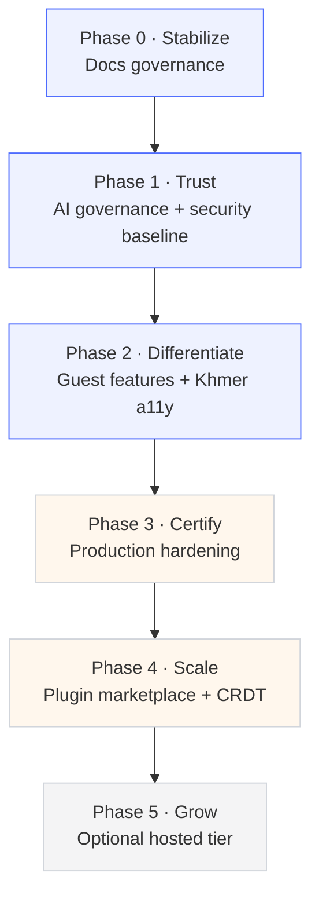

# eInvite Platform — Development Roadmap

> **For the AI agent reading this:** This document is self-contained. Read it fully before starting any task. Each phase has explicit deliverables, acceptance criteria, and file paths. Do not skip Phase 0. Do not start a phase until the previous phase's acceptance criteria are met, unless a task is explicitly marked as parallel-safe.

---

## 0. Project Context

**Project:** eInvite Platform — a self-hosted, professional invitation design & event management platform.

**Current public version:** V0.52
**Latest internal milestone:** V53.1 (AI Project Operator)
**Stack:** build-tool-free JS frontend; Python backend (`ai_agent/`, `platform_v32/`, `future_platform_v52/`)
**Storage:** SQLite / PostgreSQL; local disk or S3 / R2 / MinIO
**Scale of codebase:** 175 JS modules · 119 CSS files · 17 HTML pages · 200+ tests · 111 docs

**What already exists (do not rebuild):**
- 80 registered AI tools with typed schemas, multi-stage authorization, confirmation boundaries
- Snapshot-based publishing; optimistic-locking collaboration (SSE + polling)
- Production adapters: PostgreSQL, Redis, S3/R2, SMTP, billing, external AI
- Security: Argon2id, MFA, passkeys, CSP, same-origin checks, rate limiting, audit events

**Known weaknesses (Phase 0 addresses these):**
- `VERSION_HISTORY.md` contains factual errors (V28 is AI agent, not cross-platform; V31 is CRDT, not security)
- `ARCHITECTURE.md` predates Argon2id, MFA, passkeys, AI agent, V29–V52 layers
- `README.md` has bugs (`cd deinveitate` typo, legacy docker-compose, no demo/screenshots)
- Certification pending: native Windows/Linux 3×, full browser matrix, penetration test, load test, DR drill

---

## 1. Ground Rules for the AI Agent

1. **Never delete working code.** Refactor incrementally.
2. **Every change gets a test.** If a task touches logic, add or update a test in the existing test suite (200+ tests already exist — match the style).
3. **Bump `VERSION_HISTORY.md`** for every completed phase. One line per version. No claims without a linked file path.
4. **Keep the build-tool-free constraint.** Do not introduce bundlers, transpilers, or build steps to the frontend unless a task explicitly requires it.
5. **Stay bilingual.** Any user-facing string must have an English and Khmer variant.
6. **Never touch production data directories** during testing. Use an isolated environment.
7. **Commit style:** `phase-N: short description` (e.g., `phase-1: add AISVS C9 mapping table`).
8. **When blocked, ask.** Do not guess on ambiguous security or data-model decisions.

---

## 2. Roadmap Overview



**Critical path:** Phase 0 → Phase 1 → Phase 3 → Phase 5
**Parallel track:** Phase 2 and Phase 4 can run alongside Phase 1/3 if the agent has capacity.

| Phase ↕▾ | Duration ↕▾ | Blocks ↕▾ | Parallel-safe ↕▾ |
|---|---|---|---|
| −0 · Docs | 1–2 wk | Everything | No |
| 1 · Trust | 4–6 wk | Phase 3 | No |
| 2 · Differentiate | 6–8 wk | — | Yes |
| 3 · Certify | 6–10 wk | Phase 5 | No |
| 4 · Scale | 8–12 wk | — | Yes |
| 5 · Hosted | deferred | — | No |
⚙

---

## 3. Phase 0 — Documentation Governance

**Duration:** 1–2 weeks
**Blocks:** All other phases
**Why first:** The version history is actively misleading. Cheap to fix, high trust payoff.

### Tasks

#### 0.1 — Rewrite `VERSION_HISTORY.md`

- □  
Correct V28: it is **AI agent**, not cross-platform.
- □  
Correct V31: it is **CRDT**, not security.
- □  
Audit every entry for accuracy against actual code.
- □  
One-line description per version, no claims without a linked file path.
- □  
Format: `V{n} — {one-line} — {primary files}`

**Deliverable:** `VERSION_HISTORY.md` — accurate, complete, every version V1 through V53.1.

#### 0.2 — Rewrite `ARCHITECTURE.md`

- □  
Add Argon2id, MFA, passkeys, AI agent, V29–V52 layers.
- □  
Include a component diagram (Mermaid).
- □  
Document the storage abstraction (SQLite/PostgreSQL; local/S3/R2/MinIO).
- □  
Document the AI agent tool registry and authorization stages.
- □  
Document the collaboration model (SSE + polling, snapshot publishing).

**Deliverable:** `ARCHITECTURE.md` — accurate to current code, with a diagram a new contributor can follow.

#### 0.3 — Fix `README.md`

- □  
Fix `cd deinveitate` typo → correct directory name.
- □  
Remove legacy docker-compose instructions (or mark as deprecated with a replacement).
- □  
Add a quickstart that actually runs on a clean machine.
- □  
Add screenshots: editor, RSVP flow, AI agent, bilingual toggle.
- □  
Add a demo link (or a one-command local demo).
- □  
Add a feature list matching the market benchmark (below).

**Deliverable:** `README.md` — a new contributor can clone, run, and understand the project without asking a question.

### Acceptance Criteria for Phase 0

- A new contributor can clone, run, and understand the version history without asking the maintainer a question.
- No factual errors in `VERSION_HISTORY.md` (cross-check every entry against code).
- `README.md` quickstart works on a clean Ubuntu 22.04 VM.

---

## 4. Phase 1 — Trust Layer: AI Governance + Security Baseline

**Duration:** 4–6 weeks
**Blocks:** Phase 3
**Why:** No competitor has a *governed* AI agent. This converts the best feature into a verifiable claim.

### 1a. AI Governance (OWASP AISVS 1.0 — Chapters C9 & C10)

**Reference:** OWASP AISVS 1.0 (released June 2026, 191 requirements / 12 chapters).

- C9: Orchestration & Agentic Security
- C10: Model Context Protocol (MCP) Security
- Note: LLM06 (Excessive Agency) is now subsumed into AISVS's testable controls. Do not cite LLM06 alone.

#### Tasks

- □  
**Per-tool attack story + blast-radius documentation** for all 80 tools.

- Template per tool:

- `tool_name`
- `what_it_touches` (data, services, files)
- `worst_case_if_malicious` (concrete scenario)
- `containment` (what prevents escalation)
- `reversible` (yes/no + how)
- Location: `docs/ai/attack-stories/{tool_name}.md`
- □  
**Resource-scoped permissions** — replace `read` / `edit` / `manage` with resource-scoped grants.

- Target format: `event:{id}:publish`, `guest:{id}:delete`, `template:{id}:edit`
- Update the tool registry and the authorization layer.
- □  
**Just-in-time (JIT) elevation** for high-risk operations:

- `publish`, `delete`, `bulk_*`
- Short-lived grants (e.g., 5-minute TTL), not standing permissions.
- Log every elevation with actor, tool, resource, duration.
- □  
**Agent-security dashboard** — anomaly detection on tool-invocation patterns:

- Unusual volume (spike detection)
- Off-hours bulk operations
- Permission-denied spikes
- Repeated confirmation-boundary hits
- □  
**AISVS C9/C10 requirement mapping** — pass/fail table.

- Format: `C9.x.y | requirement text | status (pass/fail/partial) | evidence file`

**Deliverables:**

- `docs/ai/attack-stories/` (80 files)
- `docs/ai/AISVS-C9-C10-MAPPING.md`
- Updated authorization layer with resource-scoped + JIT permissions
- Agent-security dashboard (frontend + backend)

### 1b. Web Security (OWASP ASVS 5.0.0)

**Reference:** OWASP ASVS 5.0.0 (released May 2025).

- Target: **Level 2** (appropriate for a system handling personal data — guest PII and RSVPs).
- Level 1 alone is insufficient once you store guest PII.

#### Tasks

- □  
Run a **self-assessment against ASVS Level 2** across all 14 chapters.
- □  
Produce a **gap list** — requirement ID, current status, remediation.
- □  
Fix in priority order:

1. Chapter 1 — Encoding and Sanitization (injection, XSS)
2. Chapter 2 — Validation and Business Logic
3. Chapter 3 — Web Frontend Security
4. Chapter 4 — API and Web Service
5. Chapter 5 — File Handling
6. Chapter 6 — Authentication
7. Chapter 7 — Session Management
8. Chapter 8 — Authorization
9. ... through Chapter 14

**Deliverables:**

- `docs/security/ASVS-L2-GAP-ANALYSIS.md`
- Fixed issues with tests

### 1c. Backup & Disaster Recovery

**Reference:** PostgreSQL continuous archiving + PITR; pgBackRest.

#### Tasks

- □  
Configure **pgBackRest** with continuous WAL archiving to S3/R2/MinIO.

- `wal_level = replica`
- `archive_mode = on`
- `archive_timeout = 300` (or 60 for high-value tiers)
- □  
Set explicit **RPO/RTO targets per workload tier**:

- Tier 1 (RSVP + guest data): RPO minutes, RTO minutes
- Tier 2 (analytics, templates): RPO tens of minutes, RTO under an hour
- Tier 3 (internal): relaxed
- □  
**Align base-backup retention with WAL retention.**

- This is the #1 failure mode. If base backup = 30 days but WAL = 14 days, you cannot recover to day 20.
- □  
Write a **restore runbook** — short, explicit, executable by on-call at 2 AM.

- Location: `docs/ops/RESTORE-RUNBOOK.md`
- Include: incident declaration, target selection, base restore, WAL replay, validation, cutover, rollback.
- □  
Schedule the **first quarterly timed DR drill**.
- □  
Add Redis persistence strategy documentation (RDB vs AOF, or both).
- □  
Document MinIO/S3 backup strategy for user-uploaded media (design assets, photos).

**Deliverables:**

- `docs/ops/BACKUP-DR.md`
- `docs/ops/RESTORE-RUNBOOK.md`
- `docs/ops/RPO-RTO-TARGETS.md`
- One completed, timed restore drill with results logged

### Acceptance Criteria for Phase 1

- All 80 AI tools have a documented attack story.
- Resource-scoped permissions are enforced in code (not just documented).
- JIT elevation works and is logged.
- ASVS L2 gap list exists with a remediation plan.
- One full restore performed, timed, and compared against the RTO target.
- AISVS C9/C10 mapping table exists with evidence links.

---

## 5. Phase 2 — Differentiate: Guest Features + Bilingual Accessibility

**Duration:** 6–8 weeks
**Parallel-safe:** Yes

### 2a. Guest Features

These are table-stakes gaps identified in the market benchmark.

- □  
**Sign-up sheets** — guests claim items/slots (e.g., potluck, volunteer shifts).
- □  
**Polls** — host asks a question, guests vote, results visible per host setting.
- □  
**Shared photo album** — guests upload photos post-event.
- □  
**Post-send editing** — hosts can edit the invitation after sending.

- *This is a real wedge: Paperless Post and Evite both lock after send.*
- □  
**Multi-channel delivery:** SMS / WhatsApp / Telegram.

- *Email deliverability is a universal pain point. Multi-channel is a differentiator.*
- Design a channel abstraction so new channels can be added without touching core logic.

**Deliverables:**

- Each feature with backend + frontend + tests
- Channel abstraction layer documented in `ARCHITECTURE.md`

### 2b. Khmer Typography + Accessibility

**Reference:** W3C Khmer Script Resources (March 2026).

#### Tasks

- □  
**Self-host Noto Sans Khmer variable** via Fontsource.

- `npm install @fontsource-variable/noto-sans-khmer` (or equivalent for the build-tool-free setup)
- Do **not** rely on Google Fonts CDN — this is a self-hosted platform.
- □  
**Follow W3C Khmer Script Resources** for:

- Line-height (Khmer needs taller line-height than Latin — do not inherit the Latin value)
- Complex-text shaping (Khmer is an abugida; needs software shaping)
- Vertical metrics
- □  
Build a **font registry** so hosts can choose from vetted Khmer-safe fonts.
- □  
**WCAG 2.1 AA audit** across both scripts.

- Test with actual screen readers (VoiceOver, NVDA, JAWS).
- Automated tools miss Khmer-specific accessibility issues.
- □  
Audit all 17 HTML pages for Khmer rendering + accessibility.

**Deliverables:**

- Self-hosted font bundle
- `docs/i18n/KHMER-TYPOGRAPHY.md`
- `docs/a11y/WCAG-AA-AUDIT.md`
- All 17 pages passing AA

### Acceptance Criteria for Phase 2

- Guests can sign up, vote, upload photos, and receive WhatsApp/Telegram invites.
- Khmer text renders correctly on all 17 HTML pages.
- WCAG 2.1 AA pass documented for both scripts.
- Fonts are self-hosted (no external CDN dependency).

---

## 6. Phase 3 — Production Certification

**Duration:** 6–10 weeks
**Blocks:** Phase 5
**Can overlap Phase 2 if the agent has capacity.**

### Tasks

- □  
**Native Windows/Linux 3× matrix** — clean install, upgrade, rollback on each.

- Windows 11, Windows Server 2022, Windows Server 2025 (or current)
- Ubuntu 22.04 LTS, Ubuntu 24.04 LTS, Debian 12 (or current)
- □  
**Full browser matrix:**

- Chrome, Firefox, Safari, Edge (desktop)
- Safari iOS, Chrome Android (mobile)
- □  
**Penetration test** — external or structured internal, scoped against ASVS L2.

- Produce a report with findings + remediation.
- □  
**Load test** — define concurrent-user target and prove it.

- Note: RSVP spikes during wedding season are bursty. Test for burst, not just sustained.
- Tooling: Locust or k6.
- □  
**Disaster recovery drill** — timed, documented, measured RTO vs target.

- This should be the second or third drill by now (first was in Phase 1).

### Acceptance Criteria for Phase 3

- A signed certification checklist with evidence links.
- Penetration test report with all critical/high findings remediated.
- Load test report showing the platform handles the target concurrent load.
- DR drill result within the RTO target.

### Deliverable

- `docs/certification/CERTIFICATION.md` — the signed checklist with evidence.

---

## 7. Phase 4 — Scale: Plugin Marketplace + CRDT

**Duration:** 8–12 weeks
**Parallel-safe:** Yes

### 4a. Plugin Marketplace Governance

**Design principle:** Do it differently from JetBrains.

> JetBrains plugins run with **full IDE privileges — no sandbox, no fine-grained permissions.** That is the model to **avoid.** eInvite's users are non-technical event hosts; third-party plugins must be sandboxed and scoped from day one.

#### Tasks

- □  
**Plugin manifest** with declared permission scopes.

- Example manifest fields: `name`, `version`, `author`, `permissions[]`, `entrypoint`, `signature`.
- Permissions must be resource-scoped (reuse Phase 1's model).
- □  
**Double-signing:**

- Author key + eInvite marketplace CA.
- Verify signature on install; refuse unsigned or tampered plugins.
- □  
**Sandboxed execution:**

- Cross-origin iframe + MessageChannel for UI plugins.
- WASM isolation for logic plugins.
- Never full platform privileges.
- □  
**Moderation pipeline:**

- Automated pre-upload checks (structure, dependencies, suspicious patterns)
- Human review
- Post-approval takedown
- □  
**Verified Vendor badge** for identity-confirmed publishers.
- □  
**Plugin SDK + documentation** so third parties can build safely.

**Deliverables:**

- `docs/plugins/PLUGIN-SPEC.md` (manifest + signing + permissions)
- `docs/plugins/PLUGIN-SANDBOX.md`
- `docs/plugins/MODERATION-PIPELINE.md`
- Plugin SDK

### 4b. CRDT Collaboration Upgrade

**Reference:** Y.js (CRDT). Current model is snapshot + optimistic-locking (SSE + polling). This is a scoped milestone, not a rewrite.

#### Tasks

- □  
**Migrate the editor document model to Y.js.**

- Keep snapshot-publishing for versioned publish.
- CRDT is for *live* editing; snapshots are for *published* state.
- □  
**Use `y-indexeddb`** for offline persistence.
- □  
**Per-user `UndoManager`** with `trackedOrigins` scoping.

- *Pitfall: traditional single-user undo overwrites other users' work.*
- □  
**Separate cursor/presence channel from content sync.**

- *Pitfall: cursor sync delayed by content sync. Use a dedicated ephemeral channel.*
- □  
**Presence heartbeat with grace period** (5–10s) to prevent flicker.

- *Pitfall: reconnection triggers "left" events for temporary hiccups.*
- □  
**Rich media sync** — images, embeds, resize handles.

- *Pitfall: rich media has complex state that CRDT protocols don't handle natively.*
- □  
**Offline merge on reconnect** — test explicitly.

**Deliverables:**

- Y.js-backed editor
- `docs/collab/CRDT-DESIGN.md`
- Offline-merge test suite

### Acceptance Criteria for Phase 4

- A third-party plugin can be signed, sandboxed, and installed without full platform access.
- Two users can edit offline and merge cleanly on reconnect.
- Cursor sync stays under 100ms; content sync under 300ms.

---

## 8. Phase 5 — Optional Hosted Tier

**Duration:** Deferred until Phases 0–3 are complete.
**Blocks:** Nothing (this is the growth phase).

### Pricing Model

**Storage-tier pricing with no per-guest fees.**

This is the single clearest wedge against competitors:

| Competitor | Model | eInvite advantage |
|---|---|---|
| Paperless Post | Per-guest coins ($0.50–$1.44/guest) | No per-guest fees |
| Evite | Free + ads; Pro $249.99/yr | No ads; self-hostable |
| Zola | Wedding suite; formal invites are print | True digital invitations |
| Canva | Design tool; no event management | Event management included |

### Tasks

- □  
Define storage tiers (e.g., Free / Standard / Pro) with clear limits.
- □  
**Nonprofit discount** — align with the self-hosted, community-friendly positioning.
- □  
**Canva bridge** — import/export.

- *Canva wins on raw design; eInvite wins on event management. A bridge is cheaper than out-designing them.*
- □  
Hosted-tier onboarding flow.
- □  
Billing integration (reuse the existing billing adapter).

### Acceptance Criteria for Phase 5

- A host can sign up, pick a tier, and send an invitation without touching a server.
- No per-guest fees anywhere in the flow.
- Canva import/export works for at least the common template shapes.

---

## 9. Top 5 Highest-Leverage Moves (Do These First)

1. **Fix the docs first (Phase 0).** The version-history errors are actively misleading and cheap to fix.
2. **Map the AI agent to AISVS C9/C10 (Phase 1a).** Converts your best feature into a *verifiable* claim no competitor can match.
3. **Add post-send editing + multi-channel delivery (Phase 2a).** Small effort, directly attacks competitor weaknesses.
4. **Do one real DR drill (Phase 1c).** This single act closes the biggest credibility gap in your certification list.
5. **Design the plugin sandbox before you have plugins (Phase 4a).** Retrofitting scoped permissions onto a full-privilege plugin model is painful (ask JetBrains).

---

## 10. Research References

The roadmap above is grounded in the following research (steps 6–10 of the deep-research run):

### Step 6 — CRDT vs OT

- Eddyter: "7 Best Real-Time Collab React Editors 2026" — [https://eddyter.com/blogs/best-real-time-collaborative-rich-text-editor-react-2026](https://eddyter.com/blogs/best-real-time-collaborative-rich-text-editor-react-2026)
- Tech Interview: "System Design: Collaborative Document Editing" — [https://www.techinterview.org/post/3233466673/system-design-collaborative-doc/](https://www.techinterview.org/post/3233466673/system-design-collaborative-doc/)
- QueryStack: "CRDTs vs Operational Transformation" — [https://www.querystack.tech/post/crdts-vs-operational-transformation-building-real-time-collaborative-rich-text-editors-5de64f](https://www.querystack.tech/post/crdts-vs-operational-transformation-building-real-time-collaborative-rich-text-editors-5de64f)

**Key finding:** For 90% of new products in 2026, CRDT is the right choice. Y.js is the leading implementation. OT is battle-tested but rigid.

### Step 7 — Security Hardening

- OWASP ASVS 5.0.0 — [https://owasp.github.io/www-project-application-security-verification-standard/](https://owasp.github.io/www-project-application-security-verification-standard/)
- OWASP AISVS 1.0 — [https://owasp.org/www-project-artificial-intelligence-security-verification-standard-aisvs-docs/](https://owasp.org/www-project-artificial-intelligence-security-verification-standard-aisvs-docs/)
- OWASP ASVS checklist — [https://github.com/shenril/owasp-asvs-checklist](https://github.com/shenril/owasp-asvs-checklist)

**Key finding:** AISVS 1.0 (June 2026) has 191 requirements across 12 chapters. C9 (Orchestration & Agentic Security) and C10 (MCP Security) are the chapters the AI agent maps to. LLM06 is now subsumed into AISVS.

### Step 8 — Khmer Typography

- W3C Khmer Script Resources — [https://www.w3.org/International/sealreq/khmer/](https://www.w3.org/International/sealreq/khmer/)
- Noto Sans Khmer — [https://notofonts.github.io/noto-docs/specimen/NotoSansKhmerUI/](https://notofonts.github.io/noto-docs/specimen/NotoSansKhmerUI/)
- Fontsource Noto Sans Khmer — [https://fontsource.org/fonts/noto-sans-khmer/cdn](https://fontsource.org/fonts/noto-sans-khmer/cdn)

**Key finding:** Noto Sans Khmer is OFL-1.1, self-hostable, variable weight 100–900, 381 glyphs, 13 OpenType features. Khmer needs complex text shaping and taller line-height than Latin.

### Step 9 — Backup & DR

- PostgreSQL PITR docs — [https://www.postgresql.org/docs/current/continuous-archiving.html](https://www.postgresql.org/docs/current/continuous-archiving.html)
- Vela: "PostgreSQL Disaster Recovery Guide" — [https://vela.run/articles/postgresql-disaster-recovery-guide-rpo-rto-pitr-restore-testing/](https://vela.run/articles/postgresql-disaster-recovery-guide-rpo-rto-pitr-restore-testing/)
- Khimananda: "PostgreSQL PITR Playbook" — [https://khimananda.com/blog/postgresql-point-in-time-recovery-playbook](https://khimananda.com/blog/postgresql-point-in-time-recovery-playbook)

**Key finding:** pgBackRest + continuous WAL archiving gives second-level RPO. Aligning base-backup and WAL retention is the #1 failure mode. Never recover directly onto production.

### Step 10 — Plugin Marketplace

- JetBrains: "Understanding plugin security" — [https://plugins.jetbrains.com/docs/marketplace/understanding-plugin-security.html](https://plugins.jetbrains.com/docs/marketplace/understanding-plugin-security.html)
- JetBrains: "Plugin Signing" — [https://plugins.jetbrains.com/docs/intellij/plugin-signing.html](https://plugins.jetbrains.com/docs/intellij/plugin-signing.html)
- NitroIDE: "Secure Plugin Architecture: Sandboxing Third-Party Code" — [https://nitroide.com/blog/zero-trust-plugin-sandboxing.html](https://nitroide.com/blog/zero-trust-plugin-sandboxing.html)

**Key finding:** JetBrains plugins run with full IDE privileges — no sandbox, no fine-grained permissions. That is the model to avoid. Design for scoped permissions + sandboxing from day one.

### Market Benchmark (from prior research)

| Competitor ↕▾ | Model ↕▾ | Key features ↕▾ | Gaps vs eInvite ↕▾ |
|---|---|---|---|
| −Paperless Post | Per-guest coins: Free (50/yr), Basic $0.50, Premium $1.05, All Access $1.44 | 1,000s of templates, animated envelopes, RSVP, print via Paper Source | No self-hosting, no Khmer, no AI agent, no plugin/automation |
| Evite | Free + ads; Pro $249.99/yr | Free invites, RSVP, reminders, guest messaging, SignUp Sheets, Greeting Cards, Canva app | No self-hosting, no Khmer, no AI governance, aging templates |
| Zola | Wedding suite | Digital save-the-dates only; formal invites are print | No true digital invitations for the formal send |
| Canva | Design tool | Strongest overall invitation maker; templates + editor | Not event/RSVP/guest management |
⚙

---

## 11. Quick Reference: File Layout

```
docs/
├── ai/
│   ├── attack-stories/          # Phase 1a — 80 files
│   └── AISVS-C9-C10-MAPPING.md  # Phase 1a
├── security/
│   └── ASVS-L2-GAP-ANALYSIS.md  # Phase 1b
├── ops/
│   ├── BACKUP-DR.md             # Phase 1c
│   ├── RESTORE-RUNBOOK.md       # Phase 1c
│   └── RPO-RTO-TARGETS.md       # Phase 1c
├── i18n/
│   └── KHMER-TYPOGRAPHY.md      # Phase 2b
├── a11y/
│   └── WCAG-AA-AUDIT.md         # Phase 2b
├── certification/
│   └── CERTIFICATION.md         # Phase 3
├── plugins/
│   ├── PLUGIN-SPEC.md           # Phase 4a
│   ├── PLUGIN-SANDBOX.md        # Phase 4a
│   └── MODERATION-PIPELINE.md   # Phase 4a
├── collab/
│   └── CRDT-DESIGN.md           # Phase 4b
├── VERSION_HISTORY.md           # Phase 0
├── ARCHITECTURE.md              # Phase 0
└── README.md                    # Phase 0
```

---

## 12. Definition of Done (Global)

A task is done when:

1. The code or document is written.
2. Tests exist and pass.
3. `VERSION_HISTORY.md` is updated.
4. The relevant `docs/` file is updated.
5. No working code was deleted.
6. Bilingual strings are present for all user-facing text.
7. The change is committed with the `phase-N:` prefix.

---

*Last updated: 2026-09-14 — derived from deep-research run e544c4ea-dee8-4bcd-ac4a-40fb99704164 (steps 6–10).*

