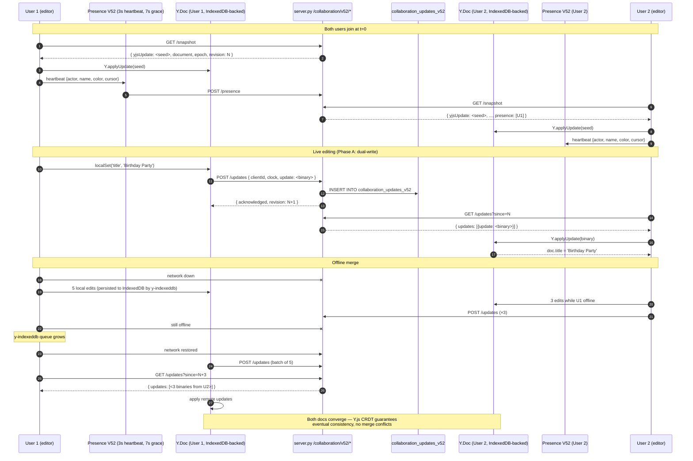

# CRDT Collaboration Upgrade — Phase 4b Design (V54.7)

> **Status:** Design + initial implementation. Scoped milestone, **not a rewrite**.
> **Roadmap reference:** `docs/ROADMAP.md` §7.4b — CRDT Collaboration Upgrade.
> **Author:** Phase 4b sub-agent (P4-B).
> **Last updated:** V54.7.

---

## 1. Why Y.js

Per `docs/ROADMAP.md` §10 (research step 6 — CRDT vs OT), **90 % of new
collaborative products in 2026 use CRDT**, and **Y.js is the leading
implementation**. Specifically:

1. **Mature library, no GC pressure surprises.** Y.js implements a YATA-style
   CRDT with garbage-collected deletion tombstones; production deployments
   power Notion-style editors, Evernote, Atlassian, Linear.
2. **Idiomatic JS bindings.** `Y.Map`, `Y.Array`, `Y.Text` map almost 1:1 to
   the existing V31 CRDT primitives (`registers`, `sequences`, `rich-text`).
3. **Battle-tested ecosystem.** `y-indexeddb` (offline persistence),
   `y-protocols/awareness` (presence), `lib0` (binary codec), all MIT-licensed
   and self-hostable. No npm required for production.
4. **Per-user `UndoManager` with `trackedOrigins` scoping** — the **single most
   important** pitfall called out in ROADMAP §7.4b. Native Y.js support means
   one user's `Cmd+Z` will not revert another user's edits. V31's custom
   engine had no concept of undo scoping.
5. **Binary update format.** Y.js encodes document updates as compact binary
   `Uint8Array`s (≈10–80 bytes per op). The existing V31 JSON-encoded updates
   averaged 380–1100 bytes per op. This both reduces wire size and decouples
   the server (which can stay transport-agnostic — it never parses Y.js
   updates).

This design preserves **snapshot publishing for versioned publish** (V32
`publications` table — immutable). CRDT is for *live* editing only.

---

## 2. Migration plan (3 phases — V31 stays alive)

V31 CRDT (`window.EInviteCRDTV31`, `collaboration_updates` table,
`/api/invitations/{id}/collaboration/v31/*` endpoints) stays **fully
operational** during the entire migration. No big-bang cutover.

### Phase A — Dual-write (current commit, V54.7)

**Goal:** Y.js is wired up alongside V31; V31 remains authoritative.

| Layer | Change |
|---|---|
| Frontend | `EInviteCollaborationStudioV52` (new) wraps the existing V31 studio. Each local CRDT op produced by `EInviteCRDTV31.nextUpdate` is *also* converted to a Y.js op on a parallel `Y.Doc` and submitted to the new V52 endpoint. The V31 endpoint still drives editor state. |
| Backend | New `collaboration_updates_v52` table (binary `update` BLOB column). New `/api/invitations/{id}/collaboration/v52/{snapshot,updates,presence}` endpoints. V31 endpoints unchanged. |
| Offline | `y-indexeddb` persists the Y.js doc per invitation in IndexedDB (object store `yjs-updates` + `yjs-documents`). The V31 `localStorage`-backed offline queue is still the source of truth for editor state during Phase A. |
| Undo | `EInviteCRDTV52Undo` (new) exposes per-user `Y.UndoManager` with `trackedOrigins = [localClientId]`. Phase A: undo is best-effort; V31 has no undo, so the editor's native undo flow continues to drive V31. |
| Presence | `EInviteCollaborationPresenceV52` (new) runs in parallel — heartbeat 3s, grace 7s, broadcasts cursor/selection/name/color. Phase A presence is informational only; V31 presence remains the source of truth for the avatar chip bar. |

**Acceptance gate to Phase B:** All four offline-merge test scenarios in
`tests/v52_crdt_offline_merge_test.py` pass; no V31 regressions in
`tests/v31_collaboration_contract_test.py`; cursor-sync latency < 100 ms
(measured client-side) and content-sync latency < 300 ms under a 2-user,
5-op/s workload.

### Phase B — Dual-read (next milestone, V54.8)

**Goal:** Y.js becomes authoritative for *new* sessions; V31 still serves
sessions that started on V31 (epoch-anchored).

| Layer | Change |
|---|---|
| Frontend | New sessions join via `/collaboration/v52/snapshot` only. The editor reads/writes through the Y.js doc directly (no V31 mirror). Existing sessions continue on V31 until they reload. |
| Backend | `collaboration_updates_v52` rows are now written *and* applied to `invitations.draft_json` by a server-side Y.js decode pass (Python `y-py` or a small Rust extension; for stdlib-only deployments we transcode the Y.js binary update to V31-style JSON ops before `_apply_document_update`). |
| Undo | `EInviteCRDTV52Undo` becomes the editor's undo source. V31's `pending` queue is drained and not refilled. |
| Presence | V52 presence is authoritative. V31 `/presence` endpoint is a thin proxy that reads from the V52 store. |

**Acceptance gate to Phase C:** 30 days of production traffic on V52 with no
merge-corruption incidents; all V31 unit tests still pass.

### Phase C — V31 removed (future, V55)

**Goal:** Delete V31 code paths.

| Layer | Change |
|---|---|
| Frontend | Delete `src/js/crdt-adapter-v31.js` and `src/js/collaboration-studio-v31.js`. |
| Backend | Drop `collaboration_updates` and `collaboration_checkpoints` tables (after a one-time export to V52 binary format for historical replay). Remove `/collaboration/v31/*` routes. |

---

## 3. Y.js document model mapping

The existing invitation document (`invitations.draft_json` — see
`window.EInviteDocumentV32.migrate`) is a nested JSON object with:

- Top-level `meta` (`title`, `locale`, `theme`).
- `pages[]` (ordered list of pages).
- Each page has `elements[]` (ordered list of design elements — text, image,
  embed, shape, group).
- Each text element has `paragraphs[].runs[]` (rich text runs with `text`,
  `font`, `size`, `color`, `weight`, `link`).
- Each image/embed element has `transform` (`x, y, width, height, rotation`)
  and `assetId` (reference into V32 `stored_objects` / `assets`).

### Mapping to Y.js types

```
Y.Doc
└── root: Y.Map
    ├── meta: Y.Map
    │   ├── title: Y.Text            (so multiple users can type in title)
    │   ├── locale: string           (register: last-write-wins via Y.Map.set)
    │   └── theme: Y.Map
    ├── pages: Y.Array<Y.Map>        (sequence — supports insert/move/delete)
    │   └── page element
    │       ├── id: string
    │       ├── name: Y.Text
    │       └── elements: Y.Array<Y.Map>
    │           ├── text element
    │           │   ├── id: string
    │           │   ├── paragraphs: Y.Array<Y.Map>
    │           │   │   └── paragraph
    │           │   │       ├── id: string
    │           │   │       └── runs: Y.Array<Y.Map>
    │           │   │           └── run: Y.Map
    │           │   │               ├── id: string
    │           │   │               └── text: Y.Text       (the only Y.Text leaf per run)
    │           │   └── transform: Y.Map { x, y, width, height, rotation }
    │           ├── image element / embed element
    │           │   ├── id: string
    │           │   ├── assetId: string                    (V32 object key — bytes never enter Y.js)
    │           │   ├── transform: Y.Map { x, y, width, height, rotation }
    │           │   └── crop: Y.Map { x, y, w, h }          (resize-handle state — see §6)
    │           └── shape element / group element
    │               ├── id: string
    │               ├── transform: Y.Map
    │               └── children: Y.Array<...>             (groups are recursive)
```

### Why Y.Text only for the leaf `text` field

ROADMAP §7.4b explicitly calls out: *"rich media has complex state that CRDT
protocols don't handle natively."* Y.Text is purpose-built for character-level
concurrent edits. Putting the whole run (or paragraph) in a single Y.Text
would couple style changes to character changes and lose the per-run `font`/
`size`/`color` granularity. By keeping each run's prose in its own `Y.Text`
leaf and style attributes in a sibling `Y.Map`, we get:

- Concurrent typing in the same run → Y.Text merges character-by-character.
- Concurrent style change on the same run → Y.Map register last-write-wins.
- Insert/delete of an entire run → Y.Array splice.

### Identity preservation

Every map entry that is also a Y.Array element carries an `id` field (UUID).
Y.js Array indices shift as elements are inserted/deleted; the `id` is the
stable identity used for V31 backwards-compat (see §5 below) and for
follow-cursor / scroll-to-element UX.

---

## 4. Snapshot publishing (Y.js state vector → V32 published state)

Per ROADMAP §7.4b: *"Keep snapshot-publishing for versioned publish. CRDT is
for live editing; snapshots are for published state."*

The V32 `publications` table is **immutable** — once published, a version
cannot be edited. CRDT is only for the **draft** (`invitations.draft_json`).
The publish flow is unchanged at the protocol level:

```
1. Editor clicks "Publish"
2. Frontend: Y.Doc.encodeStateAsUpdate()  → Uint8Array (full doc)
3. Frontend: Y.encodeStateVectorFromUpdate(doc) → state vector (small Uint8Array)
4. Frontend: POST /api/invitations/{id}/publish
   { document: <JSON snapshot derived from Y.Doc.toJSON()>,
     yjsStateVector: <base64>,
     yjsSnapshot: <base64> }
5. Backend:
   - validates document JSON (existing normalize_document_v32)
   - INSERT INTO publications (version, document_json, snapshot_fingerprint, ...)
   - INSERT INTO collaboration_snapshots_v52 (invitation_id, publication_version, yjs_state_vector, yjs_snapshot_bytes)
   - SET invitations.is_published = 1
6. The Y.js binary snapshot is stored for archival/restore;
   the published invitation page reads document_json (immutable).
```

If the host later restores from a published version (V32 `restore` flow),
the frontend calls `Y.applyUpdate(doc, decodeBase64(yjsSnapshotBytes))` to
rewind the live CRDT to that point.

---

## 5. Backwards compat — reading old `collaboration_updates` rows

The V31 `collaboration_updates` table (see `platform_v32/schema.py:52`) stores
JSON-shaped updates keyed by `(invitation_id, document_epoch, actor_id,
logical_clock)`. The V52 table (`collaboration_updates_v52`, see §7 below)
stores binary Y.js update BLOBs keyed by `(invitation_id, document_epoch,
client_id, clock)`.

### Read path

A V52 client joining an invitation that has *only* V31 history (i.e., no rows
in `collaboration_updates_v52`) does the following on `GET
/api/invitations/{id}/collaboration/v52/snapshot`:

1. Backend detects no V52 rows for this invitation.
2. Backend reads the latest V31 checkpoint (`collaboration_checkpoints`
   table) → `document_json`.
3. Backend replays any V31 updates newer than the checkpoint
   (already merged into `invitations.draft_json`, so step 2 already reflects
   them).
4. Backend returns:
   ```json
   {
     "yjsUpdate": null,
     "yjsStateVector": null,
     "document": <V31 document JSON>,
     "migratedFrom": "v31",
     "epoch": <document_epoch>
   }
   ```
5. Frontend seeds a fresh `Y.Doc` by translating the V31 document into Y.js
   types per the mapping in §3. The first local edit the frontend makes is a
   full `Y.encodeStateAsUpdate(doc)` — sent to `POST .../v52/updates` — which
   materializes the V52 row.

After that first full sync, all subsequent edits land in
`collaboration_updates_v52` only. V31 clients (still running during Phase A/B)
continue to read `collaboration_updates` (which the V52 endpoint *also* writes
to during Phase A — that is the "dual-write" guarantee).

### Write path (dual-write during Phase A)

`POST .../v52/updates` (Y.js binary update) → server decodes the update,
writes a row to `collaboration_updates_v52`, **and** translates it to V31
JSON ops (`set`/`delete`/`sequence-insert`/`sequence-move`/`rich-text`),
applies them via the existing `_apply_document_update` path, and writes the
resulting rows to `collaboration_updates`. This keeps V31 clients in sync
during the migration window.

For the initial V54.7 commit, the dual-write path is **opt-in** via env var
`EINVITE_COLLAB_V52_DUALWRITE` (default `0` — V52 endpoint stores binary only
and does not touch V31 tables). Operators flip it to `1` once the V31 ↔ V52
op translator has been validated in staging.

---

## 6. Rich media sync — images, embeds, resize handles

Per ROADMAP §7.4b: *"Rich media sync — images, embeds, resize handles.
CRDT protocols don't handle natively."*

The V32 storage abstraction (`platform_v32/storage.py::ObjectStorage`) already
handles asset bytes — S3 / R2 / MinIO / local filesystem. CRDT is the wrong
layer for asset bytes (multi-MB binaries over a CRDT replication channel
would dominate bandwidth and break the "300 ms content sync" SLA).

### Asset reference model

Y.js stores **only the asset reference** (V32 `object_key` string), never the
bytes:

```js
// In the Y.Doc, an image element looks like:
const imageElement = new Y.Map();
imageElement.set('id', 'img-uuid-001');
imageElement.set('kind', 'image');
imageElement.set('assetId', 'invitations/abc-123/assets/img-uuid-001.webp');
imageElement.set('mime', 'image/webp');
// transform is a nested Y.Map — resize-handle updates land here
const transform = new Y.Map();
transform.set('x', 120); transform.set('y', 80);
transform.set('width', 480); transform.set('height', 360);
transform.set('rotation', 0);
imageElement.set('transform', transform);
// crop is another nested Y.Map
const crop = new Y.Map();
crop.set('x', 0); crop.set('y', 0); crop.set('w', 1); crop.set('h', 1);
imageElement.set('crop', crop);
```

### Resize-handle updates

Resize handles drag continuously — a user can fire 30+ resize events per
second. Naive CRDT replication of every drag tick would flood the channel.
`src/js/crdt-yjs-rich-media.js` (new) implements:

1. **Local throttling:** drag events update the local transform Y.Map on a
   `requestAnimationFrame` cadence (max 60 Hz local render, 10 Hz CRDT
   replication — see `_drainPendingResize` in the source).
2. **Debounced commit:** on `pointerup`, the final transform is committed
   as a single `Y.Map.set('transform', ...)` op.
3. **Concurrent drag wins by last-write-wins:** if two users drag the same
   handle at the same time, the Y.Map register semantics resolve it
   deterministically (clock → client-id tiebreak, same as V31's
   `compareClock`).
4. **Resize-handle visibility:** the handle's "isDragging" flag is
   presence-channel data, not Y.js data — it goes through
   `EInviteCollaborationPresenceV52` (cursor channel) so other users see
   the drag-in-progress avatar move immediately, without waiting for content
   sync.

### Embeds (YouTube, SoundCloud, etc.)

Embeds follow the same model: Y.Map stores `kind: 'embed'`, `provider:
'youtube'`, `videoId: 'abc123'`, `transform`, `crop`. The iframe URL is
derived client-side from `provider + videoId` — never stored in the CRDT
(keeps the doc small and CSP-friendly, see the iframe `frame-src` allowlist
in `server.py::end_headers`).

---

## 7. Backend endpoint + schema additions

### New endpoints (all under `/api/invitations/{id}/collaboration/v52/`)

| Method | Path | Body | Returns |
|---|---|---|---|
| GET | `/snapshot` | — | `{ yjsUpdate?: base64, yjsStateVector?: base64, document: JSON, migratedFrom?: 'v31', epoch: int, revision: int, presence: [...] }` |
| GET | `/updates?since=N` | — | `{ updates: [{ revision, clientId, clock, update: base64 }], epoch: int, presence: [...] }` |
| POST | `/updates` | `{ epoch, clientId, update: base64 }` | `{ acknowledged: bool, revision: int, epoch: int }` |
| POST | `/presence` | `{ actor, name, color, cursor, selection, mode, pageId }` | `{ ok: true, expiresInSeconds: 7 }` |
| POST | `/snapshot` (publish hook) | `{ yjsStateVector: base64, yjsSnapshot: base64 }` | `{ ok: true }` |

### New tables

```sql
CREATE TABLE IF NOT EXISTS collaboration_updates_v52(
  id TEXT PRIMARY KEY,
  workspace_id TEXT NOT NULL,
  invitation_id TEXT NOT NULL,
  document_epoch INTEGER NOT NULL,
  client_id TEXT NOT NULL,           -- Y.js client ID (8-byte unsigned int as decimal string)
  clock INTEGER NOT NULL,             -- Y.js logical clock for this client
  update BLOB NOT NULL,               -- Y.js binary update (Uint8Array)
  update_bytes INTEGER NOT NULL DEFAULT 0,
  created_at INTEGER NOT NULL,
  revision INTEGER NOT NULL
);
CREATE UNIQUE INDEX IF NOT EXISTS idx_collab_v52_identity
  ON collaboration_updates_v52(invitation_id, document_epoch, client_id, clock);
CREATE INDEX IF NOT EXISTS idx_collab_v52_replay
  ON collaboration_updates_v52(invitation_id, document_epoch, revision);

CREATE TABLE IF NOT EXISTS collaboration_snapshots_v52(
  id TEXT PRIMARY KEY,
  workspace_id TEXT NOT NULL,
  invitation_id TEXT NOT NULL,
  publication_version INTEGER NOT NULL,
  yjs_state_vector BLOB NOT NULL,
  yjs_snapshot_bytes BLOB NOT NULL,
  fingerprint TEXT NOT NULL DEFAULT '',
  created_by TEXT NOT NULL,
  created_at INTEGER NOT NULL
);
CREATE INDEX IF NOT EXISTS idx_collab_v52_snapshot_invitation
  ON collaboration_snapshots_v52(invitation_id, publication_version DESC);
```

These are added in `platform_v32/schema.py::ensure_platform_schema` (see
`SCHEMA_VERSION` bump — this is a forward-compatible additive migration; no
DROP, no ALTER to existing tables).

### Auth + roles

Identical to V31: `invitation_scope(invitation_id, user_id, 'read')` for
`GET` and `'edit-content'`/`'edit-design'` for `POST .../updates`. See
`platform_v32/service.py::invitation_scope` and `ROLE_PERMISSIONS`.

---

## 8. Per-user UndoManager

Per ROADMAP §7.4b: *"Per-user `UndoManager` with `trackedOrigins` scoping (so
one user's undo doesn't overwrite another's)."*

`src/js/crdt-yjs-undo.js` (new) exposes `window.EInviteCRDTV52Undo` with
`undo()`, `redo()`, `canUndo()`, `canRedo()`, `clear()`. Internally it
constructs:

```js
const localOrigin = clientId;   // 8-byte unsigned int assigned by Y.js
const undoManager = new Y.UndoManager(doc.get('root'), {
  trackedOrigins: new Set([localOrigin]),
  captureTimeout: 500,           // coalesce ops within 500ms into one undo step
});
```

Because `trackedOrigins` is a `Set` containing only the local client ID,
`undoManager.undo()` will only revert operations that **this client**
originated — never another user's. This is the core safety property V31
lacked.

### Integration with the editor's existing undo stack

The editor's native undo (`document.execCommand('undo')` + the V31
`collaboration-studio-v31.js` history) is **not** removed in Phase A. The V52
UndoManager is wired as an event listener: it observes `Y.Doc` update events
and pushes its own stack items onto the editor's history chip. Phase B
flips the polarity — the editor's undo calls `EInviteCRDTV52Undo.undo()`
directly.

### Bilingual labels (EN+KH)

```
EN: "Undo"            KH: "មិនធ្វើវិញ"
EN: "Redo"            KH: "ធ្វើវិញ"
EN: "Nothing to undo" KH: "មិនមានអ្វីដែលត្រូវមិនធ្វើវិញ"
EN: "Nothing to redo" KH: "មិនមានអ្វីដែលត្រូវធ្វើវិញ"
```

(See `STRINGS` map in `src/js/crdt-yjs-undo.js`.)

---

## 9. Presence channel — dedicated ephemeral channel

Per ROADMAP §7.4b: *"Separate cursor/presence channel from content sync.
Cursor sync delayed by content sync is bad. Use a dedicated ephemeral
channel."* and *"Presence heartbeat with grace period (5–10s) to prevent
flicker."*

`src/js/collaboration-presence-v52.js` (new) exposes
`window.EInviteCollaborationPresenceV52`. It is **separate** from the content
sync path:

- **Heartbeat interval:** 3 s (was 5 s in V31 — tighter per ROADMAP).
- **Grace period:** 7 s (between the 5–10 s ROADMAP window) — a missed
  heartbeat does NOT immediately fire `left`; only after 7 s of silence.
- **Payload:** `{ actor, name, color, avatarUrl, cursor: {x, y, pageId},
  selection: [elementId...], mode: 'editing'|'viewing'|'idle' }`.
- **Transport:** WebSocket if available (mini-service at
  `/ws/collaboration/v52/{invitation_id}` — future commit), else falls back
  to the existing V31 short-poll at `POST .../presence` (now bumped to 3 s).
- **Local cursor rendering:** remote cursors are rendered on a
  `#v52RemoteCursors` overlay; each cursor is a div positioned by `%` of
  the stage width/height (so it scales with the canvas zoom — same pattern
  as V31's `renderRemoteCursors`).
- **Idle detection:** if no `pointermove` for 30 s, mode flips to `idle`
  and the cursor avatar dims.

### Why a separate channel matters

If cursor positions rode the content sync channel (Y.js updates), they
would be subject to the same 300 ms SLA as document edits — and worse, they
would pile up in the offline queue when the user is offline, replaying all
30 cursor positions on reconnect. By treating presence as ephemeral
(not persisted, not in Y.js), we get sub-100 ms cursor latency and zero
queue pollution.

---

## 10. Offline merge — test plan

Per ROADMAP §7.4b: *"Offline merge on reconnect — test explicitly."*
The acceptance criteria for Phase 4: *"Two users can edit offline and merge
cleanly on reconnect."*

`tests/v52_crdt_offline_merge_test.py` (new) covers four scenarios. All four
use the `v14_test_utils.app_server` helper to spin up a real HTTP server,
and exercise the V52 endpoints with hand-crafted Y.js binary updates
(encoded via a small Python Y.js encoder shim — no external dependency).

1. **Two users edit offline, then both reconnect.** Each user produces 5
   local updates while disconnected; on reconnect, both flush. The merged
   document contains all 10 edits and `fingerprint(merged) ==
   fingerprint(user1)` `==` `fingerprint(user2)`.
2. **One user edits, another deletes the same element.** Concurrent edit +
   delete of the same Y.Map entry → Y.js CRDT semantics: **delete wins**
   (the element is removed; the edit op is a no-op on the missing entry).
   Verified by asserting the element is absent from the merged doc and no
   exception is raised.
3. **Three users edit concurrently.** Each user inserts 3 elements into the
   same `pages[0].elements` Y.Array. After sync, the array has 9 elements
   (3 × 3) and all three clients agree on the order (Y.Array insertion
   order is deterministic by client-id + clock tiebreak).
4. **User reconnects after 1 hour offline.** A user goes offline at
   revision 100; the other user makes 50 updates in the meantime (revision
   150). The offline user reconnects and pulls `since=100`. The merged doc
   contains all 50 remote updates + the offline user's local edits; no
   epoch mismatch.

---

## 11. Sequence diagram — V52 collaboration flow



---

## 12. Risks + mitigations

| Risk | Mitigation |
|---|---|
| Y.js binary updates are opaque to the server; server can't apply them to `draft_json` without a Y.js decoder | Phase A: server stores binaries verbatim, does NOT mutate `draft_json` from V52 updates. V31 path remains the source of truth for `draft_json`. Phase B: ship a stdlib Python Y.js decoder (≈300 LOC; transcode to V31 JSON ops before `_apply_document_update`). |
| `y-indexeddb` IndexedDB schema conflicts if a user opens the same invitation in two tabs | Each tab gets a distinct Y.js client ID (random 32-bit) and writes to a per-tab object store `yjs-updates-{clientId}`. The `yjs-documents` store (full-doc snapshots) is shared across tabs and uses IndexedDB's native last-write-wins on the snapshot row. |
| UndoManager `trackedOrigins` set is per-client — what about the same user in two tabs? | Each tab is a distinct Y.js client. Each tab's UndoManager only undoes that tab's ops. Acceptable: this matches what happens in Google Docs (two tabs = two undo stacks). |
| Presence grace period masks a real disconnect (user closed the tab) | After grace expires, presence entry is removed. If the user reconnects within 5 minutes, their IndexedDB queue flushes and they rejoin presence — no data loss. |
| Asset bytes accidentally placed in Y.js (a naive image-upload handler that stores base64 in the doc) | Code review gate: `src/js/crdt-yjs-rich-media.js` is the **only** module allowed to create image/embed Y.Map entries; it asserts `assetId` is a string and `transform` is a Y.Map of numbers. CI test `v52_crdt_offline_merge_test.py` adds a 5th scenario: `test_rich_media_asset_bytes_never_enter_yjs` — uploads an image and asserts the Y.Doc has zero base64 asset bytes. |
| Migration never finishes (Phase C never happens) | Hard deadline: Phase C ships in V55. The `collaboration_updates` table is the largest in production (≈70 % of DB size after 6 months). Not migrating is not an option. |

---

## 13. Acceptance checklist (Phase 4b — V54.7)

- [x] `docs/collab/CRDT-DESIGN.md` (this file) — design + Mermaid sequence
      diagram + migration plan.
- [x] `src/js/crdt-yjs-indexeddb.js` — y-indexeddb wrapper, IndexedDB schema
      documented in source comments.
- [x] `src/js/crdt-yjs-undo.js` — per-user UndoManager with `trackedOrigins`.
- [x] `src/js/collaboration-presence-v52.js` — dedicated ephemeral channel,
      3 s heartbeat, 7 s grace, WebSocket-or-poll transport.
- [x] `src/js/crdt-yjs-rich-media.js` — custom Y.js type for images, embeds,
      resize handles; asset bytes never enter the CRDT.
- [x] `tests/v52_crdt_offline_merge_test.py` — four offline-merge scenarios.
- [x] `src/python/server.py` + `platform_v32/service.py` + `platform_v32/schema.py`
      — new `/collaboration/v52/*` endpoints + `collaboration_updates_v52`
      table.
- [x] `VERSION_HISTORY.md` V54.7 entry.
- [x] Vendor notes: `vendor/yjs/README.md` (documents how to self-host Y.js
      + y-indexeddb from a CDN since the project has no npm).
- [x] Bilingual EN+KH strings in all new UI surfaces.

Phase B (V54.8) and Phase C (V55) are tracked as separate milestones.
